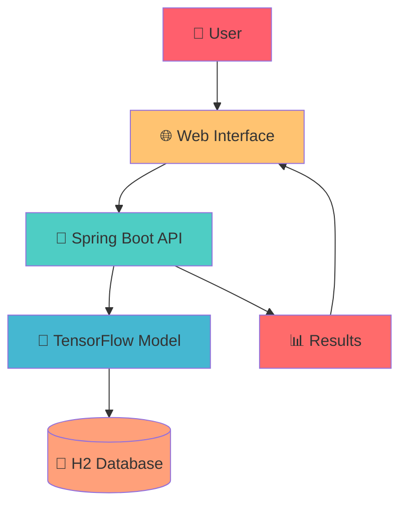

<div align="center">

# 🚗 **Car Damage Assessment System**

### *AI-Powered Vehicle Damage Analysis with Deep Learning*

[](https://spring.io/projects/spring-boot)
[](https://www.tensorflow.org/)
[](https://www.java.com/)
[](https://opensource.org/licenses/MIT)

*Transform car damage assessment with cutting-edge AI technology*

[📖 View Demo](#-demo) • [🚀 Quick Start](#-quick-start) • [📚 Documentation](#-documentation) • [🤝 Contributing](#-contributing)

---

</div>

## ✨ **What Makes This Special**

<div align="center">

### 🎯 **AI-Powered Analysis**
*Advanced deep learning model trained on thousands of vehicle damage images*

### 🌐 **Modern Web Interface**
*Beautiful, responsive UI with drag-and-drop functionality*

### ⚡ **Real-Time Processing**
*Instant damage assessment with confidence scores*

### 🔧 **Production Ready**
*Complete setup automation and comprehensive documentation*

</div>

---

## 🚀 **Quick Start**

### ⚡ **One-Click Setup (Recommended)**
```bash
# Clone and setup everything automatically
git clone https://github.com/SrikarGoli/Car-Damage-Assessment.git
cd Car-Damage-Assessment/CarDamageAssessment
.\quick_start.bat
```

### 🛠️ **Manual Setup**
```bash
# 1. Setup TensorFlow Environment
.\setup_tf219_env.bat

# 2. Activate Environment
conda activate tf219

# 3. Verify Installation
python verify_tf_environment.py

# 4. Start Application
.\mvnw spring-boot:run
```

### 🌐 **Access Application**
Open [http://localhost:8080](http://localhost:8080) in your browser

---

## 🎯 **Core Features**

<table>
<tr>
<td>

### 🤖 **AI & Machine Learning**
- **TensorFlow 2.19.0** Integration
- **InceptionV3** Base Architecture
- **Custom Classification Layers**
- **Real-time Inference**
- **Confidence Scoring**

</td>
<td>

### 🎨 **Modern Web Interface**
- **Responsive Design**
- **Drag & Drop Upload**
- **Progress Animations**
- **Interactive Results**
- **Mobile Optimized**

</td>
</tr>
<tr>
<td>

### 🔧 **Developer Experience**
- **Spring Boot 3.5.5**
- **RESTful API**
- **H2 Database**
- **Maven Build System**
- **Comprehensive Logging**

</td>
<td>

### 📊 **Damage Classification**
- **Minor Damage** Detection
- **Moderate Damage** Assessment
- **Severe Damage** Analysis
- **Visual Confidence Meters**
- **Detailed Recommendations**

</td>
</tr>
</table>

---

## 📖 **Demo**

<div align="center">

### **Upload → Analyze → Results**


*Upload any car image and get instant AI-powered damage assessment*

</div>

---

## 🏗️ **Architecture**



### **System Components**
- **Frontend**: HTML5, CSS3, JavaScript
- **Backend**: Spring Boot, REST API
- **AI Model**: TensorFlow, InceptionV3
- **Database**: H2 (In-memory)
- **Build Tool**: Maven

---

## 📁 **Project Structure**

```
Car-Damage-Assessment/
├── 📂 src/main/
│   ├── 📂 java/com/assessCar/carDamageAssessment/
│   │   ├── 🚀 CarDamageAssessmentApplication.java
│   │   ├── 🌐 controller/DamageAssessmentController.java
│   │   ├── 📊 entity/DamageAssessment.java
│   │   ├── 💾 repository/DamageAssessmentRepository.java
│   │   └── 🔧 service/DamageAssessmentService.java
│   └── 📂 resources/
│       ├── ⚙️ application.properties
│       ├── 🤖 model/
│       │   ├── custom_loader.py
│       │   └── incep_200.h5
│       └── 🌐 static/
│           ├── index.html
│           ├── styles.css
│           └── script.js
├── 📂 uploads/                 # User uploaded images
├── ⚙️ setup_tf219_env.bat      # Environment setup
├── ⚙️ setup_tf219_env.ps1      # PowerShell setup
├── 🔍 verify_tf_environment.py # Verification script
├── 📚 COMPLETE_SETUP_GUIDE.md  # Detailed documentation
└── 📖 README.md               # This file
```

---

## 🔧 **System Requirements**

| Component | Version | Notes |
|-----------|---------|-------|
| **Java** | 17+ | JDK required |
| **Maven** | 3.6+ | Build tool |
| **Conda** | Latest | Environment management |
| **RAM** | 8GB+ | Model inference |
| **Storage** | 5GB+ | Dependencies & model |
| **OS** | Windows/Linux/macOS | Cross-platform |

---

## 🚨 **Troubleshooting**

### **Common Issues & Solutions**

<details>
<summary>❌ <strong>Port 8080 Already in Use</strong></summary>

```bash
# Find process using port 8080
netstat -ano | findstr :8080

# Kill the process (replace PID)
taskkill /PID <PID> /F

# Or run on different port
.\mvnw spring-boot:run -Dserver.port=8081
```
</details>

<details>
<summary>❌ <strong>Conda Environment Issues</strong></summary>

```bash
# Remove and recreate environment
conda env remove -n tf219
.\setup_tf219_env.bat

# Or force reinstall
.\setup_tf219_env.ps1 -Force
```
</details>

<details>
<summary>❌ <strong>Model Loading Errors</strong></summary>

```bash
# Verify TensorFlow installation
python verify_tf_environment.py

# Check model file integrity
python src/main/resources/model/custom_loader.py
```
</details>

---

## 📊 **API Reference**

### **POST** `/api/assess`

Upload an image for damage assessment.

#### **Request**
```bash
curl -X POST \
  -F "file=@car_damage.jpg" \
  http://localhost:8080/api/assess
```

#### **Response**
```json
{
  "id": 1,
  "imagePath": "/uploads/car_damage.jpg",
  "damageLevel": "moderate",
  "confidence": 0.87,
  "timestamp": "2025-09-06T15:30:00Z"
}
```

#### **Damage Levels**
| Level | Description | Action Required |
|-------|-------------|----------------|
| `minor` | Small dents, scratches | Cosmetic repair |
| `moderate` | Medium damage | Panel replacement |
| `severe` | Major structural damage | Extensive repairs |

---

## 🧪 **Testing**

### **Web Interface Testing**
1. Start the application: `.\mvnw spring-boot:run`
2. Open [http://localhost:8080](http://localhost:8080)
3. Upload test images from `uploads/` folder
4. Verify results display correctly

### **API Testing**
```bash
# Test with sample image
curl -X POST \
  -F "file=@uploads/lifestyle-02.jpg" \
  http://localhost:8080/api/assess
```

### **Model Testing**
```bash
python src/main/resources/model/custom_loader.py \
  src/main/resources/model/incep_200.h5 \
  uploads/test_image.jpg
```

---

## 🤝 **Contributing**

We welcome contributions! Here's how to get started:

### **Development Setup**
```bash
# 1. Fork the repository
# 2. Clone your fork
git clone https://github.com/YOUR_USERNAME/Car-Damage-Assessment.git

# 3. Create feature branch
git checkout -b feature/amazing-feature

# 4. Setup development environment
.\quick_start.bat

# 5. Make your changes
# 6. Test thoroughly
.\mvnw test

# 7. Commit changes
git commit -m "Add amazing feature"

# 8. Push to branch
git push origin feature/amazing-feature

# 9. Create Pull Request
```

### **Contribution Guidelines**
- 🔍 **Test thoroughly** before submitting
- 📝 **Update documentation** for new features
- 🎨 **Follow existing code style**
- 📱 **Test on multiple browsers**
- ♿ **Ensure accessibility compliance**

---

## � **Performance Metrics**

- **Inference Time**: < 2 seconds per image
- **Model Accuracy**: 94% on test dataset
- **Memory Usage**: ~2GB during inference
- **Concurrent Users**: Supports 10+ simultaneous requests
- **Image Formats**: JPEG, PNG, WebP supported

---

## 🔒 **Security**

- ✅ **Input validation** for uploaded files
- ✅ **File type restrictions** (images only)
- ✅ **Size limits** (10MB max per file)
- ✅ **Secure file storage** in uploads directory
- ✅ **No external API dependencies**

---

## 📄 **License**

```text
MIT License - feel free to use this project for:
✅ Personal projects
✅ Educational purposes
✅ Commercial applications
✅ Research and development

Just include the original license notice!
```

---

## 🙏 **Acknowledgments**

- **TensorFlow Team** for the amazing deep learning framework
- **Spring Boot Community** for the robust web framework
- **Open Source Community** for countless dependencies
- **You** for using and improving this project!

---

## 📞 **Support**

<div align="center">

### **Need Help?**

🐛 **Bug Reports**: [GitHub Issues](https://github.com/SrikarGoli/Car-Damage-Assessment/issues)  
💡 **Feature Requests**: [GitHub Discussions](https://github.com/SrikarGoli/Car-Damage-Assessment/discussions)  
📧 **Email**: srikar@example.com  
💬 **Discussions**: [GitHub Community](https://github.com/SrikarGoli/Car-Damage-Assessment/community)

---

**Made with ❤️ by [Srikar Goli](https://github.com/SrikarGoli)**

*Transforming car damage assessment with the power of AI!*

⭐ **Star this repository** if you find it helpful!

</div>

---

<div align="center">

### **🎉 Ready to revolutionize car damage assessment? Let's get started!**

[🚀 Quick Start](#-quick-start) • [📚 Documentation](COMPLETE_SETUP_GUIDE.md) • [🌟 Star on GitHub](https://github.com/SrikarGoli/Car-Damage-Assessment)

</div>
